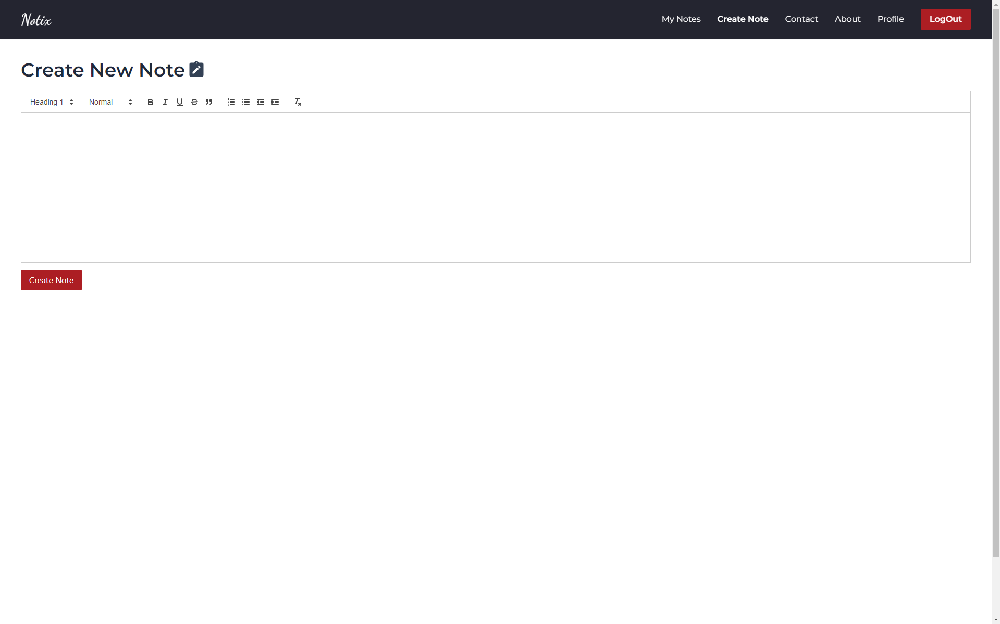

# Notix

**"Notix – Capture, Organize, Remember."**

Notix is a comprehensive note-taking application designed to help users efficiently create, manage, and track their records. The application employs a Spring Boot backend, providing a robust and scalable server-side architecture, with MySQL as the database for reliable data storage and management. On the frontend, React.js is used to deliver a smooth and responsive user interface, enhancing the overall user experience.

Security is a priority in Notix. The application features JWT (JSON Web Token) authentication and role-based access control, ensuring users' data is well-protected and accessible according to permissions. Users can log in securely using their email and password, or through Google or GitHub OAuth integrations. Additionally, two-factor authentication (2FA) has been implemented to provide an extra layer of security, safeguarding against unauthorized access.

Notix offers an efficient and secure environment for users to organize and track their notes, combining powerful backend functionality with a user-friendly frontend.

## Photos

